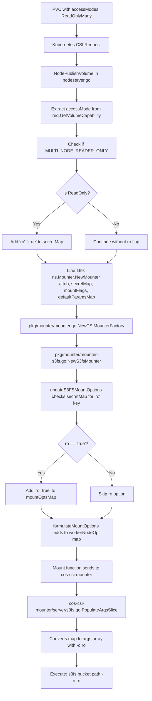

# How AccessMode Information Flows to Mounter

## Complete Data Flow



## Step-by-Step Code Flow

### Step 1: NodeServer Receives Request (pkg/driver/nodeserver.go)

**Line 77-169**: NodePublishVolume function
```go
func (ns *nodeServer) NodePublishVolume(_ context.Context, req *csi.NodePublishVolumeRequest) {
    // Line 112: Get readonly flag (boolean)
    readOnly := req.GetReadonly()
    
    // NEW CODE: Get actual access mode from volume capability
    volumeCapability := req.GetVolumeCapability()
    accessMode := volumeCapability.GetAccessMode().GetMode()
    
    // Line 118: Get secrets map
    secretMap := req.GetSecrets()
    
    // ... existing code for gid, endpoints, etc ...
    
    // NEW CODE: Check access mode and add ro flag to secretMap
    if accessMode == csi.VolumeCapability_AccessMode_MULTI_NODE_READER_ONLY || readOnly {
        secretMap["ro"] = "true"  // <-- THIS IS HOW WE SEND IT TO MOUNTER
        klog.V(2).Infof("Setting read-only mount for volume %s", volumeID)
    }
    
    // Line 169: Pass secretMap to mounter
    mounterObj := ns.Mounter.NewMounter(attrib, secretMap, mountFlags, defaultParamsMap)
    //                                           ^^^^^^^^^ 
    //                                           secretMap contains "ro": "true"
}
```

### Step 2: Mounter Factory (pkg/mounter/mounter.go)

**Line 48**: NewMounter receives secretMap
```go
func (s *CSIMounterFactory) NewMounter(attrib map[string]string, 
                                        secretMap map[string]string,  // <-- Contains "ro": "true"
                                        mountFlags []string, 
                                        defaultMOMap map[string]string) Mounter {
    // Line 74: Create S3FS mounter with secretMap
    return NewS3fsMounter(secretMap, mountFlags, mounterUtils, defaultMOMap)
    //                    ^^^^^^^^^
    //                    Passes secretMap to S3FS mounter
}
```

### Step 3: S3FS Mounter Constructor (pkg/mounter/mounter-s3fs.go)

**Line 53**: NewS3fsMounter receives secretMap
```go
func NewS3fsMounter(secretMap map[string]string,  // <-- Contains "ro": "true"
                    mountOptions []string, 
                    mounterUtils utils.MounterUtils, 
                    defaultParams map[string]string) Mounter {
    
    mounter := &S3fsMounter{}
    
    // Extract bucket, endpoint, auth info from secretMap
    // ... existing code ...
    
    // Line 106: Update mount options with secretMap
    updatedOptions := updateS3FSMountOptions(mountOptions, secretMap, defaultParams)
    //                                                      ^^^^^^^^^
    //                                                      Passes secretMap to update function
    mounter.MountOptions = updatedOptions
    
    return mounter
}
```

### Step 4: Update Mount Options (pkg/mounter/mounter-s3fs.go)

**Line 215**: updateS3FSMountOptions processes secretMap
```go
func updateS3FSMountOptions(defaultMountOp []string, 
                            secretMap map[string]string,  // <-- Contains "ro": "true"
                            defaultParams map[string]string) []string {
    
    mountOptsMap := make(map[string]string)
    
    // Create map from default mount options
    for _, val := range defaultMountOp {
        // ... parse options ...
    }
    
    // Line 239-241: Check for gid
    if val, check := secretMap["gid"]; check {
        mountOptsMap["gid"] = val
    }
    
    // NEW CODE: Check for ro flag in secretMap
    if val, check := secretMap["ro"]; check && val == "true" {
        mountOptsMap["ro"] = "true"  // <-- Add to mount options map
        klog.Infof("Adding read-only mount option for s3fs")
    }
    
    // Line 271-290: Convert map back to array
    updatedOptions := []string{}
    for key, val := range mountOptsMap {
        if key == val {
            updatedOptions = append(updatedOptions, val)  // Just "ro"
        } else {
            updatedOptions = append(updatedOptions, fmt.Sprintf("%s=%s", key, val))  // "ro=true"
        }
    }
    
    return updatedOptions  // Returns ["ro=true", "gid=1000", ...]
}
```

### Step 5: Formulate Mount Options (pkg/mounter/mounter-s3fs.go)

**Line 306**: formulateMountOptions creates final command args
```go
func (s3fs *S3fsMounter) formulateMountOptions(bucket, target, passwdFile string) ([]string, map[string]string) {
    // Base options
    nodeServerOp := []string{bucket, target, "-o", "sigv2", ...}
    workerNodeOp := map[string]string{"sigv2": "true", ...}
    
    // Line 332-342: Add mount options from s3fs.MountOptions
    for _, val := range s3fs.MountOptions {  // <-- Contains "ro=true"
        nodeServerOp = append(nodeServerOp, "-o")
        nodeServerOp = append(nodeServerOp, val)  // Adds "ro=true"
        
        splitVal := strings.Split(val, "=")
        if len(splitVal) == 1 {
            workerNodeOp[splitVal[0]] = "true"  // workerNodeOp["ro"] = "true"
        } else {
            workerNodeOp[splitVal[0]] = splitVal[1]  // workerNodeOp["ro"] = "true"
        }
    }
    
    return nodeServerOp, workerNodeOp
    // nodeServerOp: [bucket, path, "-o", "sigv2", "-o", "ro=true", ...]
    // workerNodeOp: {"sigv2": "true", "ro": "true", ...}
}
```

### Step 6: Mount Function (pkg/mounter/mounter-s3fs.go)

**Line 114**: Mount sends to worker
```go
func (s3fs *S3fsMounter) Mount(source string, target string) error {
    // Line 160: Get mount options
    args, wnOp := s3fs.formulateMountOptions(bucketName, target, passwdFile)
    //            ^^^^
    //            wnOp contains {"ro": "true", ...}
    
    if mountWorker {
        // Line 165: Marshal to JSON
        jsonData, err := json.Marshal(wnOp)  // {"ro":"true", ...}
        
        // Line 171: Create payload
        payload := fmt.Sprintf(`{"path":"%s","bucket":"%s","mounter":"%s","args":%s}`, 
                              target, bucketName, constants.S3FS, jsonData)
        //                                                                  ^^^^^^^^
        //                                                                  Contains ro flag
        
        // Line 175: Send to worker
        err = mounterRequest(payload, "http://unix/api/cos/mount")
    }
}
```

### Step 7: Worker Processes Request (cos-csi-mounter/server/s3fs.go)

**Line 48**: PopulateArgsSlice converts map to command args
```go
func (args S3FSArgs) PopulateArgsSlice(bucket, targetPath string) ([]string, error) {
    // Marshal S3FSArgs struct to JSON
    raw, err := json.Marshal(args)  // args.ReadOnly = "true"
    
    // Unmarshal into map[string]string
    var m map[string]string
    json.Unmarshal(raw, &m)  // m["ro"] = "true"
    
    // Convert to key=value slice
    result := []string{bucket, targetPath}
    
    // Line 80-87: Process each key-value pair
    for k, v := range m {
        result = append(result, "-o")
        if strings.ToLower(strings.TrimSpace(v)) == "true" {
            result = append(result, k)  // Just "-o", "ro"
        } else {
            result = append(result, fmt.Sprintf("%s=%v", k, v))  // "-o", "ro=true"
        }
    }
    
    return result, nil
    // Returns: [bucket, path, "-o", "sigv2", "-o", "ro", ...]
}
```

## Summary: The secretMap is the Key!

**The answer to your question**: We send accessMode information to the mounter through the **`secretMap`** parameter!

### The Flow:
1. **NodeServer** checks accessMode → adds `secretMap["ro"] = "true"`
2. **NewMounter** receives `secretMap` as parameter
3. **updateS3FSMountOptions** reads `secretMap["ro"]` → adds to `mountOptsMap`
4. **formulateMountOptions** converts to command args
5. **Mount** sends to worker with ro flag
6. **Worker** executes: `s3fs bucket path -o ro`

### Why secretMap?
- It's already used to pass credentials (accessKey, secretKey, apiKey)
- It's already used to pass configuration (gid, uid, tmpdir, use_cache)
- It flows through the entire mounter chain
- It's the standard way to pass parameters from NodeServer to Mounter

### Code Changes Summary:
```go
// In nodeserver.go (Line ~130)
if accessMode == csi.VolumeCapability_AccessMode_MULTI_NODE_READER_ONLY || readOnly {
    secretMap["ro"] = "true"  // <-- Add to secretMap
}

// In mounter-s3fs.go (Line ~247)
if val, check := secretMap["ro"]; check && val == "true" {
    mountOptsMap["ro"] = "true"  // <-- Read from secretMap
}
```

That's it! The secretMap carries the ro flag through the entire chain.