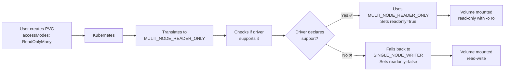

# What is MULTI_NODE_READER_ONLY?

## Quick Answer

`MULTI_NODE_READER_ONLY` is the **CSI specification's name** for Kubernetes' `ReadOnlyMany` access mode.

## Kubernetes vs CSI Terminology

| Kubernetes PVC | CSI Driver Constant | Meaning |
|----------------|---------------------|---------|
| `ReadWriteOnce` | `SINGLE_NODE_WRITER` | One node can read/write |
| `ReadWriteMany` | `MULTI_NODE_MULTI_WRITER` | Multiple nodes can read/write |
| **`ReadOnlyMany`** | **`MULTI_NODE_READER_ONLY`** | **Multiple nodes can read (no writes)** |
| `ReadWriteOncePod` | `SINGLE_NODE_SINGLE_WRITER` | One pod can read/write |

## Breaking Down MULTI_NODE_READER_ONLY

### MULTI_NODE
- **MULTI** = Multiple
- **NODE** = Kubernetes nodes (worker machines)
- Means: The volume can be attached to **multiple nodes at the same time**

### READER_ONLY
- **READER** = Read access
- **ONLY** = No write access
- Means: All nodes can **only read**, cannot write

### Combined Meaning
**"Multiple nodes can mount this volume, but only for reading"**

## Real-World Example

### Scenario: Shared Configuration Files

```yaml
# PVC with ReadOnlyMany
apiVersion: v1
kind: PersistentVolumeClaim
metadata:
  name: shared-config
spec:
  accessModes:
    - ReadOnlyMany  # <-- Kubernetes term
  resources:
    requests:
      storage: 1Gi
```

**What happens:**
1. You create a PVC with `ReadOnlyMany`
2. Kubernetes translates this to `MULTI_NODE_READER_ONLY` for the CSI driver
3. Multiple pods on different nodes can mount the same volume
4. All pods can read files
5. No pod can write/modify files

### Use Cases

✅ **Good for:**
- Shared configuration files
- Static website content
- Machine learning models
- Reference data
- Logs that should not be modified

❌ **Not good for:**
- Databases (need write access)
- Application logs (need to write)
- Temporary files (need write access)

## Why Two Different Names?

### Kubernetes Perspective (User-Friendly)
- `ReadOnlyMany` - Clear, describes what user wants
- Focus: "I want multiple pods to read this"

### CSI Specification (Technical)
- `MULTI_NODE_READER_ONLY` - Precise, describes implementation
- Focus: "Multiple nodes, reader access only"

## In Your Code

### Before (Only supported read-write):
```go
volumeCapabilities = []csi.VolumeCapability_AccessMode_Mode{
    csi.VolumeCapability_AccessMode_SINGLE_NODE_WRITER,  // ReadWriteOnce
}
```

### After (Now supports read-only):
```go
volumeCapabilities = []csi.VolumeCapability_AccessMode_Mode{
    csi.VolumeCapability_AccessMode_SINGLE_NODE_WRITER,     // ReadWriteOnce
    csi.VolumeCapability_AccessMode_MULTI_NODE_READER_ONLY, // ReadOnlyMany ✅
}
```

## How It Works in Your Driver



## Practical Example

### Pod 1 on Node A:
```bash
$ kubectl exec pod1 -- cat /mnt/data/config.txt
Hello World  # ✅ Can read

$ kubectl exec pod1 -- echo "test" > /mnt/data/config.txt
bash: /mnt/data/config.txt: Read-only file system  # ❌ Cannot write
```

### Pod 2 on Node B (Different Node):
```bash
$ kubectl exec pod2 -- cat /mnt/data/config.txt
Hello World  # ✅ Can also read (MULTI_NODE)

$ kubectl exec pod2 -- echo "test" > /mnt/data/config.txt
bash: /mnt/data/config.txt: Read-only file system  # ❌ Cannot write (READER_ONLY)
```

## Summary

| Term | Where Used | Meaning |
|------|------------|---------|
| `ReadOnlyMany` | Kubernetes PVC | User-friendly name |
| `MULTI_NODE_READER_ONLY` | CSI Driver Code | Technical implementation name |
| `ROX` | kubectl output | Short form (ReadOnlyMany) |
| `-o ro` | s3fs command | Mount option for read-only |

**Bottom Line**: They all mean the same thing - **multiple nodes can read, but nobody can write**.

## Why This Matters for Your Issue

Your PVC `balraj-cos-pvc-2` has:
```yaml
accessModes:
  - ReadOnlyMany  # You set this
```

But your driver was showing `readonly: false` because:
1. Driver didn't declare support for `MULTI_NODE_READER_ONLY`
2. Kubernetes couldn't use `ReadOnlyMany` mode
3. Fell back to `ReadWriteOnce` (SINGLE_NODE_WRITER)
4. Result: `readonly = false`

Now with the fix:
1. Driver declares support for `MULTI_NODE_READER_ONLY` ✅
2. Kubernetes can use `ReadOnlyMany` mode ✅
3. Driver sets `readonly = true` ✅
4. Volume mounted with `-o ro` flag ✅