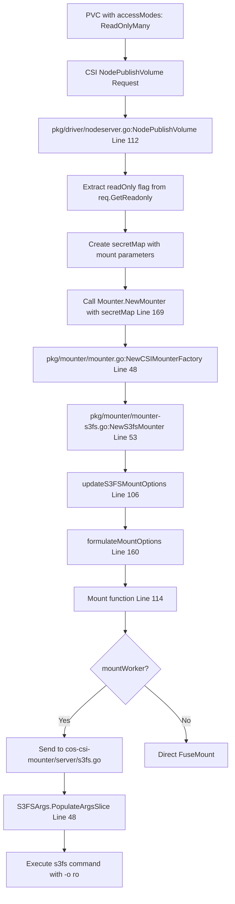
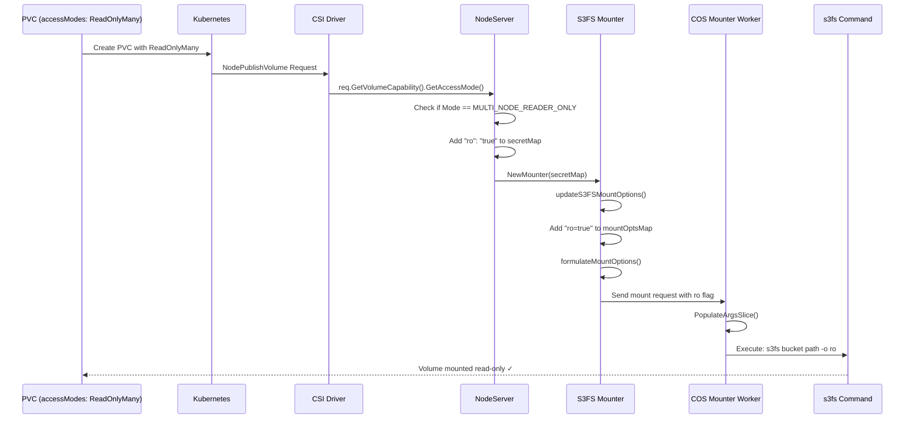

# ReadOnlyMany Access Mode Implementation Plan

## Overview
Implement support for `ReadOnlyMany` access mode in the IBM Object CSI Driver to add the `-o ro` flag to s3fs mounts when PVC specifies read-only access.

---

## Current Flow Analysis

### Request Flow for Volume Mount



---

## Problem Statement

**Current Behavior:**
- User sets PVC with `accessModes: ReadOnlyMany`
- CSI driver retrieves `readOnly` flag at line 112 in nodeserver.go
- Flag is logged but **never used** when mounting
- Result: Volume is mounted as read-write despite PVC specification

**Root Cause:**
1. Driver only declares `SINGLE_NODE_WRITER` capability (pkg/driver/s3-driver.go:32-34)
2. `readOnly` flag is retrieved but not passed to mounter
3. s3fs mount command doesn't include `-o ro` flag

---

## Components Involved

### 1. **pkg/driver/s3-driver.go**
- **Lines 30-34**: Volume capability declaration
- **Current**: Only `SINGLE_NODE_WRITER` supported
- **Change Needed**: Add `MULTI_NODE_READER_ONLY` capability (maps to ReadOnlyMany in Kubernetes)

### 2. **pkg/driver/nodeserver.go**
- **Line 112**: `readOnly := req.GetReadonly()` - boolean flag (may not reflect PVC accessMode)
- **Line 97-99**: `req.GetVolumeCapability()` - contains the actual access mode from PVC
- **Lines 118-131**: secretMap creation
- **Change Needed**: Check `VolumeCapability.AccessMode.Mode` for `MULTI_NODE_READER_ONLY` and add ro flag to secretMap

### 3. **pkg/mounter/mounter-s3fs.go**
- **Lines 215-304**: `updateS3FSMountOptions` function
- **Change Needed**: Check for readonly flag in secretMap and add to mount options

### 4. **cos-csi-mounter/server/s3fs.go**
- **Lines 12-46**: S3FSArgs struct with ReadOnly field
- **Lines 48-90**: PopulateArgsSlice function
- **Lines 234-240**: Validation for ro parameter
- **Status**: Already supports `ro` field - no changes needed

---

## Implementation Steps

### Step 1: Add READ_ONLY_MANY Capability
**File**: `pkg/driver/s3-driver.go`
**Lines**: 30-34

**Current Code**:
```go
var (
    // volumeCapabilities represents how the volume could be accessed.
    volumeCapabilities = []csi.VolumeCapability_AccessMode_Mode{
        csi.VolumeCapability_AccessMode_SINGLE_NODE_WRITER,
    }
```

**Modified Code**:
```go
var (
    // volumeCapabilities represents how the volume could be accessed.
    volumeCapabilities = []csi.VolumeCapability_AccessMode_Mode{
        csi.VolumeCapability_AccessMode_SINGLE_NODE_WRITER,
        csi.VolumeCapability_AccessMode_MULTI_NODE_READER_ONLY,
    }
```

**Rationale**:
- Declare support for read-only multi-node access mode
- `MULTI_NODE_READER_ONLY` is the CSI equivalent of Kubernetes `ReadOnlyMany` access mode
- This allows the driver to accept PVCs with `accessModes: [ReadOnlyMany]`

---

### Step 2: Check Access Mode and Pass ReadOnly Flag to Mounter
**File**: `pkg/driver/nodeserver.go`
**Lines**: 112-131

**Current Code**:
```go
readOnly := req.GetReadonly()
attrib := req.GetVolumeContext()
mountFlags := req.GetVolumeCapability().GetMount().GetMountFlags()
klog.V(2).Infof("-NodePublishVolume-: targetPath: %v\ndeviceID: %v\nreadonly: %v\nvolumeId: %v\nattributes: %v\nmountFlags: %v\n",
    targetPath, deviceID, readOnly, volumeID, attrib, mountFlags)

secretMap := req.GetSecrets()
// ... existing code ...
if volumeMountGroup != "" {
    secretMap["gid"] = volumeMountGroup
}
```

**Modified Code**:
```go
readOnly := req.GetReadonly()
attrib := req.GetVolumeContext()
mountFlags := req.GetVolumeCapability().GetMount().GetMountFlags()
volumeCapability := req.GetVolumeCapability()
accessMode := volumeCapability.GetAccessMode().GetMode()

klog.V(2).Infof("-NodePublishVolume-: targetPath: %v\ndeviceID: %v\nreadonly: %v\naccessMode: %v\nvolumeId: %v\nattributes: %v\nmountFlags: %v\n",
    targetPath, deviceID, readOnly, accessMode, volumeID, attrib, mountFlags)

secretMap := req.GetSecrets()
// ... existing code ...
if volumeMountGroup != "" {
    secretMap["gid"] = volumeMountGroup
}

// Check if access mode is MULTI_NODE_READER_ONLY (ReadOnlyMany) or if readonly flag is set
if accessMode == csi.VolumeCapability_AccessMode_MULTI_NODE_READER_ONLY || readOnly {
    secretMap["ro"] = "true"
    klog.V(2).Infof("-NodePublishVolume-: Setting read-only mount for volume %s (accessMode: %v, readOnly: %v)",
        volumeID, accessMode, readOnly)
}
```

**Rationale**:
- `req.GetReadonly()` is a boolean flag that may or may not be set correctly
- The actual access mode from PVC is in `VolumeCapability.AccessMode.Mode`
- We check for `MULTI_NODE_READER_ONLY` which corresponds to Kubernetes `ReadOnlyMany`
- We also keep the `readOnly` flag check as a fallback
- Pass the readonly flag to the mounter via secretMap so it can be processed during mount option construction

---

### Step 3: Handle ReadOnly in Mount Options
**File**: `pkg/mounter/mounter-s3fs.go`
**Lines**: 215-304 (updateS3FSMountOptions function)

**Current Code** (around line 240):
```go
if val, check := secretMap["gid"]; check {
    mountOptsMap["gid"] = val
}

if secretMap["gid"] != "" && secretMap["uid"] == "" {
    mountOptsMap["uid"] = secretMap["gid"]
} else if secretMap["uid"] != "" {
    mountOptsMap["uid"] = secretMap["uid"]
}
```

**Modified Code**:
```go
if val, check := secretMap["gid"]; check {
    mountOptsMap["gid"] = val
}

if secretMap["gid"] != "" && secretMap["uid"] == "" {
    mountOptsMap["uid"] = secretMap["gid"]
} else if secretMap["uid"] != "" {
    mountOptsMap["uid"] = secretMap["uid"]
}

// Add read-only mount option if specified
if val, check := secretMap["ro"]; check && val == "true" {
    mountOptsMap["ro"] = "true"
    klog.Infof("Adding read-only mount option for s3fs")
}
```

**Rationale**: Check for the `ro` flag in secretMap and add it to mount options map. This will be included in the final mount command.

---

### Step 4: Verify cos-csi-mounter Support
**File**: `cos-csi-mounter/server/s3fs.go`
**Status**: ✅ Already supports readonly

**Existing Code**:
- **Line 35**: `ReadOnly string json:"ro,omitempty"` - struct field exists
- **Lines 234-240**: Validation for ro parameter exists
- **Lines 80-87**: PopulateArgsSlice handles boolean flags correctly

**No changes needed** - the mounter server already supports the `ro` flag.

---

## Data Flow Diagram



---

## Testing Plan

### Test Case 1: ReadOnlyMany PVC
**PVC Configuration**:
```yaml
apiVersion: v1
kind: PersistentVolumeClaim
metadata:
  name: test-readonly-pvc
spec:
  accessModes:
    - ReadOnlyMany
  resources:
    requests:
      storage: 10Gi
  storageClassName: ibm-cos-s3fs
```

**Expected Behavior**:
1. PVC binds successfully
2. Pod mounts volume
3. Logs show: `readonly: true`
4. Mount command includes: `-o ro`
5. Write operations fail with "Read-only file system" error

**Verification Commands**:
```bash
# Check mount options
mount | grep s3fs

# Try to write (should fail)
kubectl exec -it <pod> -- touch /mnt/test-file

# Check logs
kubectl logs <csi-node-pod> | grep "readonly: true"
kubectl logs <csi-node-pod> | grep "Adding read-only mount option"
```

### Test Case 2: ReadWriteMany PVC (Regression)
**PVC Configuration**:
```yaml
apiVersion: v1
kind: PersistentVolumeClaim
metadata:
  name: test-readwrite-pvc
spec:
  accessModes:
    - ReadWriteMany
  resources:
    requests:
      storage: 10Gi
  storageClassName: ibm-cos-s3fs
```

**Expected Behavior**:
1. PVC binds successfully
2. Pod mounts volume
3. Logs show: `readonly: false`
4. Mount command does NOT include: `-o ro`
5. Write operations succeed

---

## Files to Modify

| File | Lines | Change Type | Description |
|------|-------|-------------|-------------|
| `pkg/driver/s3-driver.go` | 30-34 | Add | Add READ_ONLY_MANY capability |
| `pkg/driver/nodeserver.go` | 131-135 | Add | Pass ro flag to secretMap |
| `pkg/mounter/mounter-s3fs.go` | 247-252 | Add | Handle ro flag in mount options |

---

## Rollback Plan

If issues arise:
1. Revert changes to `pkg/driver/s3-driver.go` (remove READ_ONLY_MANY)
2. Revert changes to `pkg/driver/nodeserver.go` (remove ro flag addition)
3. Revert changes to `pkg/mounter/mounter-s3fs.go` (remove ro handling)
4. Rebuild and redeploy driver

---

## Additional Considerations

### 1. **Access Mode Validation**
The driver should validate that the requested access mode is supported. Currently, this validation happens in the CSI spec layer.

### 2. **Rclone Support**
This plan focuses on s3fs. If rclone also needs readonly support, similar changes would be needed in:
- `pkg/mounter/mounter-rclone.go`
- `cos-csi-mounter/server/rclone.go`

### 3. **Documentation Updates**
After implementation, update:
- README.md with supported access modes
- Storage class examples with ReadOnlyMany
- User documentation

### 4. **Backward Compatibility**
All changes are additive and don't break existing functionality:
- Existing PVCs with ReadWriteMany continue to work
- New capability is opt-in via PVC accessModes
- Default behavior unchanged

---

## Summary

This implementation adds proper support for ReadOnlyMany access mode by:
1. ✅ Declaring READ_ONLY_MANY capability
2. ✅ Extracting readonly flag from CSI request
3. ✅ Passing flag through secretMap to mounter
4. ✅ Adding `-o ro` to s3fs mount command
5. ✅ Leveraging existing mounter server support

**Estimated Effort**: 2-3 hours (coding + testing)
**Risk Level**: Low (additive changes, existing validation in place)
**Testing Required**: Unit tests + integration tests with ReadOnlyMany PVC